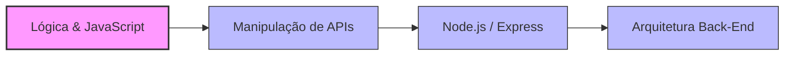

# Olá, eu sou o Angel! 👋 (`colonezdev`)

## 🚀 Sobre mim

Sou desenvolvedor focado em **Back-End Development** e **Software Architecture**.

🎓 Formado em **Data Science pela FIAP**  
📚 Estudando **Computer Science na UNICESUMAR (2027)**

Atualmente meus estudos estão voltados para:

- JavaScript
- Node.js
- SQL
- HTML5
- CSS3

---

## 🧑‍💻 Stack & Skills

```javascript
const dev = {
  nome: "Angel",
  foco: ["Back-End Development", "Software Architecture"],
  formacao: [
    "Data Science @ FIAP",
    "Computer Science (2027)"
  ],
  estudosAtuais: "JavaScript Avançado & Ecossistema Node.js"
};
```

---

## 📈 Roadmap



---

## 📊 GitHub Stats


---

## 🏅 Tecnologias


---

## 📫 Contato

📍 São Paulo - Brasil

📧 **colonez.dev@gmail.com**

💼 **LinkedIn:** https://linkedin.com/in/colonez
